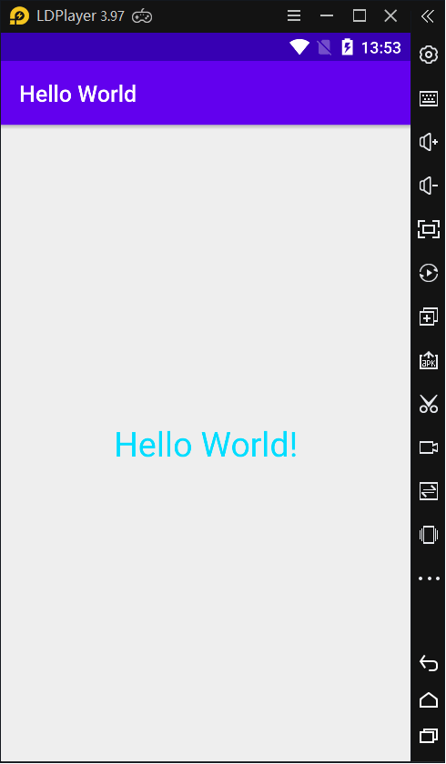
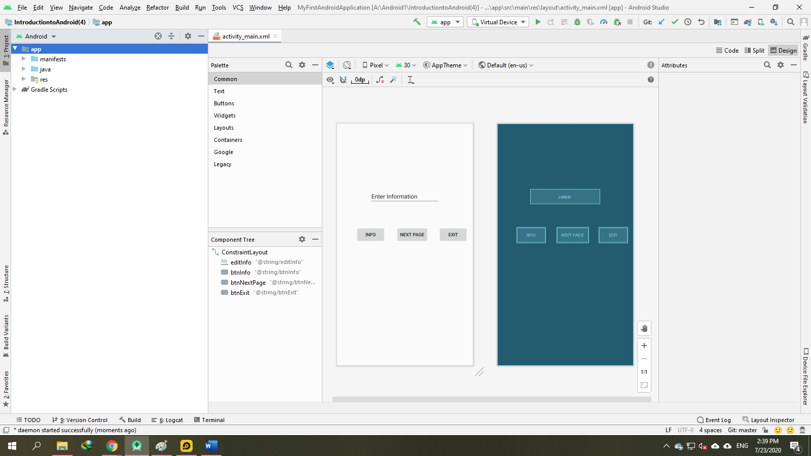

### Introduction to Android Programming in Android Studio 4.0

- <a href= "https://ngocminhtran.com/2018/06/28/lap-trinh-android-dung-androidhttps://dzone.com/articles/introduction-to-android-programming-using-the-andr"> Ứng Dụng Từ Bài</a>

### Create a New Project
- Open Android Studio 3.0
- Choose File > New > New Project
- Enter Application name: My_First_Android_App

- <a href="https://github.com/ChanhMinions/DaoQuanhUngDungAndroid">Có Thể Xem Lại Bài Trước</a>

- Click Next, accept the default options, and Finish.
- By default, a Hello World message will occur on the main screen, as in the following screenshot:

- Thực hiện các bước giúp Chúng Ta Có Thẻ Hiểu Rõ Hơn Phần này:
- Click sẽ hiện ra phần quan trọng như trong hình:

